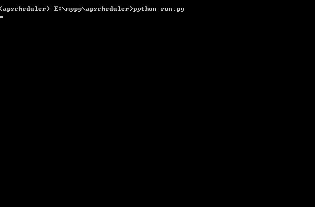

## EMonitor

an environment monitor tool based on scheduled task

## Requirement

* apscheduler
* fabric
* ensure time synchronization between local and remote host
* target hosts only support linux/Unix which could enable ssh

### Usage

* Configure hosts info including hostname/username/password/groups from [hosts.py](config/hosts.py)

<pre><code>{
        "hostname":"10.100.138.30:2222",
        "username":"yxgly",
        "password":"0okm,lp-",
        "groups":[
            "all",
            "webserver",
            "dbserver",
            "nginxserver"
            ]
        } </code></pre>

* Customize monitor script to [script](script/), example: [memory_check.py](script/memory_check.py)

* Customize task class for monitor script in [task.py](task.py), which including warning condition and mail details

<pre><code>class TaskDiskCheck(Model):

	def task_job(self):
		result = run('python /app/EMonitor/Script/disk_check.py')
		for filesystem, usage in ast.literal_eval(result).items():
			if int(usage.rstrip("%")) > 95:
				send(_mail_info())

	def _mail_info(self):
		MAIL_INFO['mail_subject'] = "Warning from {0}".format(self.__class__.__name__)
		MAIL_INFO['mail_text'] = "Host: {0}\n\rResult: {1}".format(env.host_string.split(":")[0], result)
		return MAIL_INFO </code></pre>

* Assign monitor task/ hosts group/ interval time to a scheduler in [run.py](run.py)

<pre><code>class Schedule(object):
    def __init__(self):
       self.scheduler = BackgroundScheduler()
       self.scheduler.add_job(TaskMemCheck('all', 'memory_check').task_execute, 'interval', seconds=3)
       self.scheduler.add_job(TaskDiskCheck('all', 'disk_check').task_execute, 'interval', seconds=5)
       self.scheduler.print_jobs()</code></pre>

* Execute from cmdline

## License
MIT
